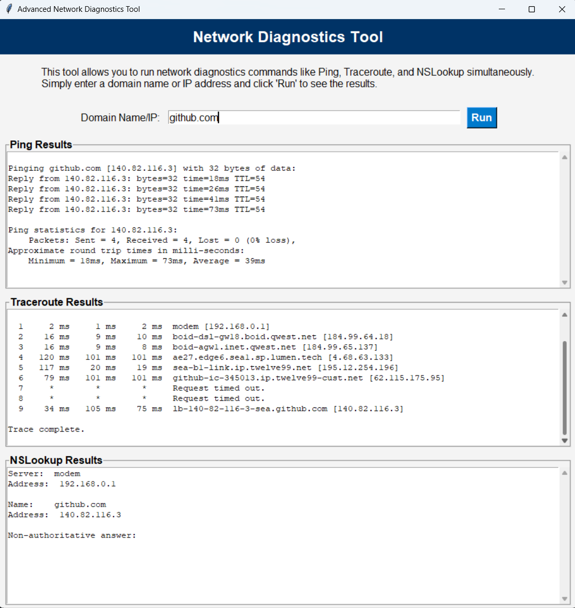

# Multi-Command Troubleshooting Tool
This is a simple yet effective troubleshooting tool for device connectivity and network connection, instead of having to manually run ping, then nslookup, and then tracert/traceroute for example, you can run them all side by side!

## Code

``` Python
import os
import subprocess
import threading
import tkinter as tk
from tkinter import scrolledtext, messagebox

def run_command(command, output_widget):
    """Run a system command and display the output in the GUI."""
    try:
        process = subprocess.Popen(command, stdout=subprocess.PIPE, stderr=subprocess.PIPE, text=True)
        for line in process.stdout:
            output_widget.insert(tk.END, line)
        for line in process.stderr:
            output_widget.insert(tk.END, line)
    except Exception as e:
        output_widget.insert(tk.END, f"Error: {e}\n")

def run_diagnostics(domain):
    """Run diagnostics commands in parallel threads."""
    for widget in [ping_output, traceroute_output, nslookup_output]:
        widget.delete(1.0, tk.END)  # Clear previous output

    # Run Ping
    threading.Thread(target=run_command, args=(["ping", "-c", "4", domain] if os.name != "nt" else ["ping", domain], ping_output)).start()

    # Run Traceroute
    threading.Thread(target=run_command, args=(["traceroute", domain] if os.name != "nt" else ["tracert", domain], traceroute_output)).start()

    # Run nslookup
    threading.Thread(target=run_command, args=(["nslookup", domain], nslookup_output)).start()

def on_run():
    """Handle the 'Run' button click."""
    domain = domain_entry.get().strip()
    if domain:
        run_diagnostics(domain)
    else:
        messagebox.showerror("Input Error", "Please enter a domain name or IP address.")

# Create the GUI
root = tk.Tk()
root.title("Advanced Network Diagnostics Tool")
root.geometry("900x700")
root.configure(bg="#f4f4f4")

# Header
header_frame = tk.Frame(root, bg="#003366", pady=10)
header_frame.pack(fill="x")

header_label = tk.Label(header_frame, text="Network Diagnostics Tool", bg="#003366", fg="white", font=("Arial", 18, "bold"))
header_label.pack()

# Description
description_frame = tk.Frame(root, bg="#f4f4f4", pady=10)
description_frame.pack(fill="x")

description_label = tk.Label(
    description_frame,
    text=(
        "This tool allows you to run network diagnostics commands like Ping, Traceroute, "
        "and NSLookup simultaneously. Simply enter a domain name or IP address and click 'Run' to see the results."
    ),
    bg="#f4f4f4",
    fg="black",
    font=("Arial", 12),
    wraplength=800,
    justify="left"
)
description_label.pack(pady=5)

# Input Frame
input_frame = tk.Frame(root, bg="#f4f4f4")
input_frame.pack(pady=10)

tk.Label(input_frame, text="Domain Name/IP:", bg="#f4f4f4", font=("Arial", 12)).grid(row=0, column=0, padx=5)
domain_entry = tk.Entry(input_frame, width=50, font=("Arial", 12))
domain_entry.grid(row=0, column=1, padx=5)
run_button = tk.Button(input_frame, text="Run", command=on_run, bg="#007ACC", fg="white", font=("Arial", 12, "bold"))
run_button.grid(row=0, column=2, padx=5)

# Output Frames
ping_frame = tk.LabelFrame(root, text="Ping Results", bg="#f4f4f4", font=("Arial", 12, "bold"), fg="black")
ping_frame.pack(fill="both", expand=True, padx=10, pady=5)
ping_output = scrolledtext.ScrolledText(ping_frame, height=8, wrap=tk.WORD, font=("Courier", 10))
ping_output.pack(fill="both", expand=True)

traceroute_frame = tk.LabelFrame(root, text="Traceroute Results", bg="#f4f4f4", font=("Arial", 12, "bold"), fg="black")
traceroute_frame.pack(fill="both", expand=True, padx=10, pady=5)
traceroute_output = scrolledtext.ScrolledText(traceroute_frame, height=8, wrap=tk.WORD, font=("Courier", 10))
traceroute_output.pack(fill="both", expand=True)

nslookup_frame = tk.LabelFrame(root, text="NSLookup Results", bg="#f4f4f4", font=("Arial", 12, "bold"), fg="black")
nslookup_frame.pack(fill="both", expand=True, padx=10, pady=5)
nslookup_output = scrolledtext.ScrolledText(nslookup_frame, height=8, wrap=tk.WORD, font=("Courier", 10))
nslookup_output.pack(fill="both", expand=True)

# Run the GUI event loop
root.mainloop()

```

# Example Output



